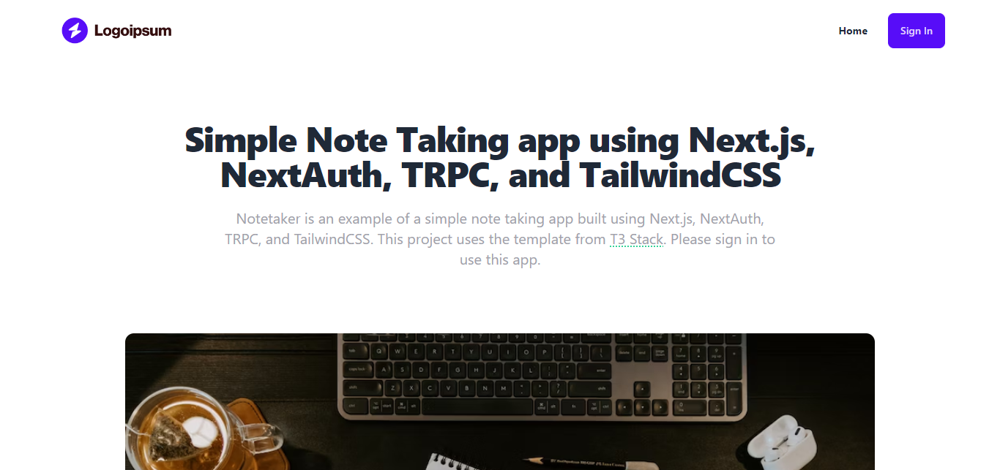

# Notetaker

Notetaker is an example of a simple note taking app built using Next.js, NextAuth, TRPC, and TailwindCSS. This project uses the template from T3 Stack.

Live example hosted on Vercel: https://notetaker-ikram-maulana.vercel.app/



## 🔑 Getting Github Client ID and Secret

To get your Github Client ID and Secret, you need to create a Github OAuth app. You can follow the steps from [this guide](https://scribehow.com/shared/Getting_Github_Client_ID_and_Secret__KEf9Rk1FQtOzi5CaVFJxyA). then add your `GITHUB_CLIENT_ID` and `GITHUB_CLIENT_SECRET` to your `.env` file.

## 🖥️ Running Locally

1. Clone this repo

   ```bash
   https://github.com/Ikram-Maulana/notetaker.git
   ```

2. Install dependencies

   ```bash
   pnpm install
   ```

3. Add your `GITHUB_CLIENT_ID` and `GITHUB_CLIENT_SECRET` to your `.env` file

   ```bash
   GITHUB_CLIENT_ID=YOUR_CLIENT_ID
   GITHUB_CLIENT_SECRET=YOUR_CLIENT_SECRET
   ```

4. Run the development server

   ```bash
    pnpm dev
   ```

5. Open [http://localhost:3000](http://localhost:3000) with your browser to see the result.

## 🚀 Deploy on Vercel

1. Fork this repo

2. Create a new project on Vercel

3. Import your repo

4. Add your `GITHUB_CLIENT_ID` and `GITHUB_CLIENT_SECRET` to your Vercel project's environment variables (**_Note: Make another Github OAuth app for your production deployment_**)

5. Deploy
